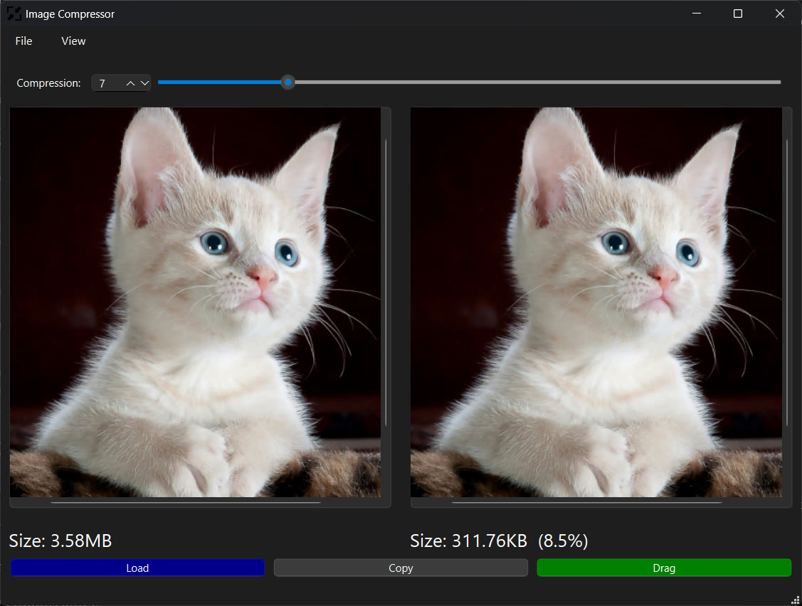

# Simple Image Compressor
A simple GUI tool to compress an image. 

Written in **Python** using QT library **PySide6**.

## Features
You can select the compression value in the range 1 to 31.

You can zoom and compare the source image with the compressed image. 

### Output Options:
- Save the compressed image to any folder.
- Copy the compressed image to clipboard by clicking `Copy` button.
- Drag and drop the compressed image into other applications: click the `Drag` button and then drag.

### Controls
- Click and drag to pan.
- Ctrl + scroll to zoom. 
- Scroll to vertical scroll.
- Shift + scroll to horizontal scroll.

Scrolling and panning on the compressed image are synchronized with the source image.
